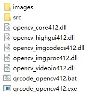

# qrcode-opencv
OpenCV实现qrcode二维码定位点检测

# requirement
* OpenCV 4.1.2<br>
* VS2017

# usage
## 1. 编辑 qrcode-opencv412.bat
```
qrcode_opencv412.exe ./images/4.jpg
```
* params0: qrcode_opencv412.exe
* params1: 待识别图片路径
## 2. 解压qrcode-opencv412-dll.rar<br>


# preview


